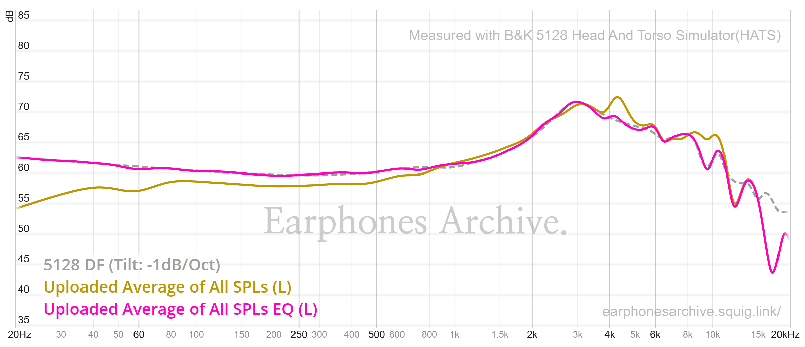
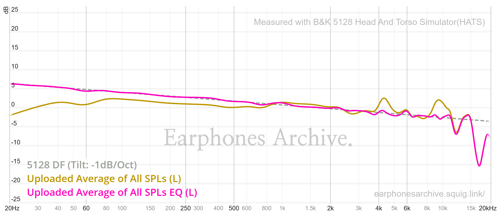
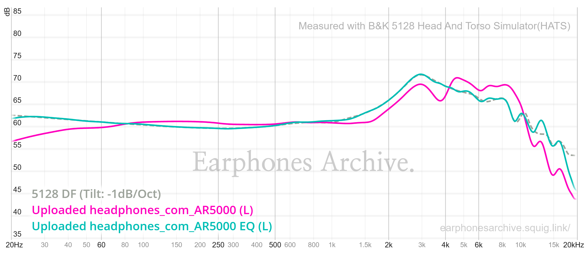
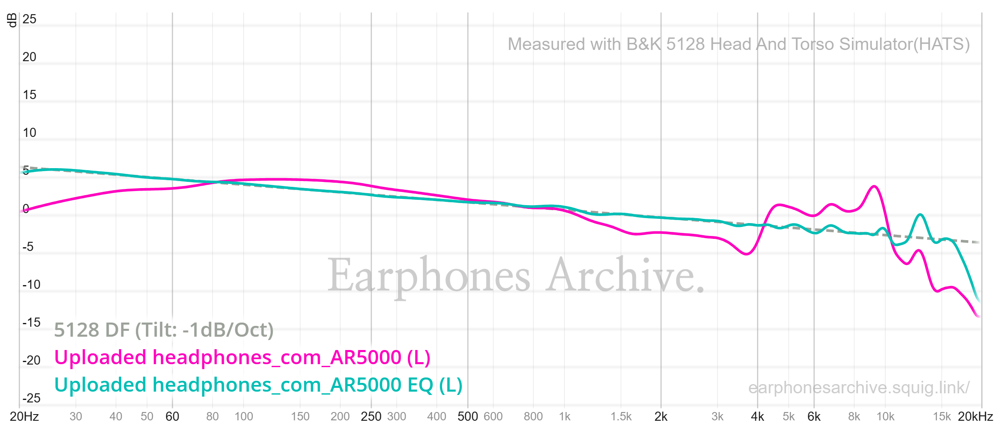

# My Headphones Calibration Files 

> [!NOTE]
> These files are compatible with my [CalCurve VST plugin](https://github.com/Mixomo/CalCurve)

## Preface

The [Brüel & Kjær 5128 HATS](https://media.hbkworld.com/m/8beb5a6068848d30/original/High-frequency-Head-and-Torso-Simulator-Type-5128-Family.pdf) is a high-frequency Head and Torso Simulator designed for acoustic measurements that need to approximate how sound interacts with a human head, torso, outer ear, ear canal, and eardrum reference point. It is commonly used for headphone and earphone measurements, hearing-device evaluation, telephony, voice communication testing, spatial audio work, and other cases where the interaction between a device and human anatomy matters.

The 5128 family includes different configurations and variants depending on the measurement task, such as head-and-torso setups, ear simulator configurations, pinna options, and systems intended for headphone, headset, communication, or hearing-related testing. In headphone measurement communities, "5128" usually refers to measurements made with this newer generation of anatomically realistic ear simulators, which can differ noticeably from older couplers or fixtures, especially in the upper midrange and treble.

A Diffuse Field target represents the frequency response that would be measured at the ear reference point in an ideal diffuse sound field, where sound arrives evenly from many directions rather than from a single speaker position. For headphones, compensating toward a 5128 Diffuse Field target is one way to make the headphone response resemble a neutral acoustic reference at the simulated eardrum. In this project, the Diffuse Field target is used with a -1 dB per octave tilt, which gently slopes the target downward as frequency increases.

## Why Use a -1 dB per Octave Tilt?

The tilt is used because an uncompensated Diffuse Field target is a useful anatomical and measurement reference, but it is not usually the most preferred final tonal balance for normal music listening. Headphones.com describes Diffuse Field as a valid calibration baseline, while also noting that listener-preference research has made it clear that Diffuse Field on its own is generally not preferred.

A downward tilt also makes the target closer to the tonal balance of neutral loudspeakers in a room, where the perceived response at the listening position normally trends downward from bass to treble. 

## Project Notes

These measurements and calibrations were prepared in [squig.link](https://squig.link/) using the Earphone Archives and Listener databases, following the [Brüel & Kjær 5128 HATS](https://media.hbkworld.com/m/8beb5a6068848d30/original/High-frequency-Head-and-Torso-Simulator-Type-5128-Family.pdf) Diffuse Field target with a -1 dB per octave tilt.

The adjustments were created while accounting for the inherent limitations of parametric equalizers. Residual errors and unavoidable differences from the target curve were refined with AI assistance capable of vision, understanding, and graphing, with the goal of following the target as precisely as possible.

For the Sennheiser HD560S, a 5128 measurement was found in Earphone Archives.

For the Aune AR5000, it was necessary to extract the RAW measurement published by Listener / Resolve (Headphones.com) in the article for this headphone. That measurement was then imported into squig.link for further work.

For both headphones, the repository includes RAW measurement exports, the shared `DF_5128_tilt_minus_one_per_octave_target_curve.txt` target curve, CSV files compatible with APO Equalizer and Melda FreeForm EQ (VST for DAW use), parametric EQ files compatible with APO / Peace GUI, and `.txt` files compatible with Wavelet on Android and APO Equalizer using the `GraphicEQ:` format. The original GraphicEQ exported by AutoEQ from squig.link is also included for each headphone, along with images of the RAW and compensated measurements with their respective EQs.

For the Aune AR5000, an additional calibration based on my personal preference is included. It was obtained through an AI-assisted intelligent weighting process which used the original DF 5128 calibration of the Sennheiser HD560S as a reference, preserving the Senn deep bass, relaxing the treble a little bit and cleaning up the nasal midrange of the original DF 5128 calibration for the Aune AR5000.

This preference calibration may be less technically "correct", or perhaps not, since the Aune AR5000 required RAW measurements from outside Earphone Archives. In practice, both headphones now share a very similar calibrated timbre that is easy to listen to, and in the case of the Aune AR5000, this preference calibration starts from the DF 5128 with only minimal changes.

## Links

- [B&K 5128 HATS PDF](https://media.hbkworld.com/m/8beb5a6068848d30/original/High-frequency-Head-and-Torso-Simulator-Type-5128-Family.pdf)
- [Headphones.com: Diffuse Field: Calculate, Characterize, Calibrate](https://headphones.com/blogs/features/diffuse-field)
- [SoundGuys: Harman Target and SoundGuys Preference Curve on B&K 5128](https://www.soundguys.com/harman-target-soundguys-preference-curve-validated-125420/)
- [Earphone Archives squig.link](https://earphonesarchive.squig.link/headphones/?share=5128_DF_Target)
- [Listener squig.link](https://listener800.github.io/5128hp.html?share=5128_DF_Target&bass=0&tilt=-1&halftilt=0&treble=0&ear=0&air=0&bassfreq=105&treblefreq=2500&earfreq=3000&airfreq=10000)
- [Headphones.com Aune AR5000 discussion](https://forum.headphones.com/t/aune-ar5000/23109)

## Images

### Sennheiser HD560S

- RAW measurement + EQ

- compensated measurement + EQ

### Aune AR5000

- RAW measurement + EQ

- compensated measurement + EQ

